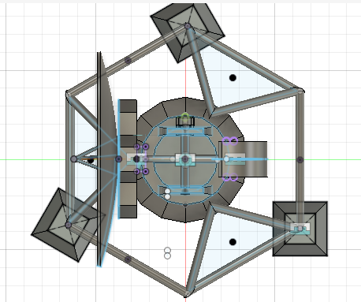
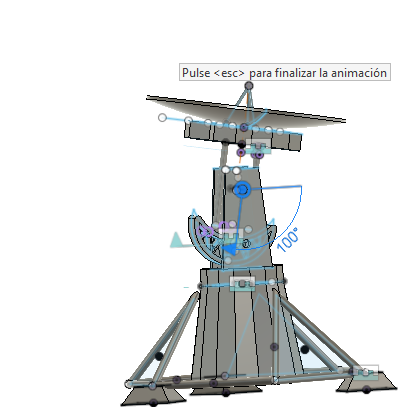
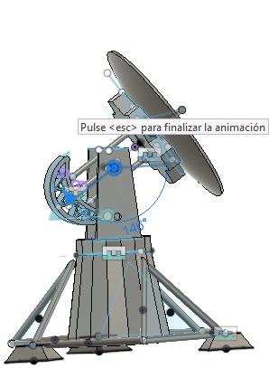
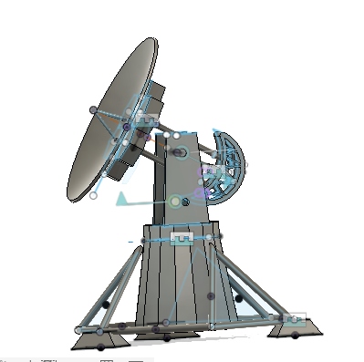

# Radiotelescope_project

Colombia's geographical conditions are highly diverse. Regions such as the La Candelaria Desert (Boyacá), La Bricha rural area (Macaravita, Santander), and the Upper Guajira (surrounding the Macuira National Natural Park) offer exceptionally low radio frequency interference (RFI) and minimal light pollution. Consequently, Colombia possesses optimal conditions for advanced astronomical observations. This project focuses on building a functional, scaled radio telescope prototype completely from scratch.

## Design Specifications

This project is divided into 4 key stages:
* **Stage 1:** Tracking and Control System
* **Stage 2:** RF (Radio Frequency) Design and Implementation
* **Stage 3:** Data Visualization and Heatmap Generation
* **Stage 4:** Machine Learning (AI) Integration and Implementation
  
## Stage 1: Tracking and Control System
The goal of this system is to accurately track diverse cosmic **radio sources**. This enables the system to capture data at different times and intervals to study various astronomical **phenomena**.

It utilizes the following hardware and software components: 
* **ESP32-C3 SuperMini** (Microcontroller)
* **Servo Motors** (Actuators for pan/tilt movement)
* **Python** (Core development language)
* **Astropy** (Library for astronomical calculations)
* **3D Printing** (Enclosures and structural parts)

This system is designed to be highly replicable at different scales.

> **Note:** This stage does not include a real antenna.

## Stage 2: RF (Radio Frequency) Design and Implementation
The goal of this stage is to implement an LNA (Low Noise Amplifier) and an SDR (Software Defined Radio), leveraging advanced DSP (Digital Signal Processing) algorithms to capture, filter, and process the various signals acquired by the system.

It utilizes the following hardware and software components:
* **To be defined**

> **Note:** This stage includes a prototype with a real antenna.

## Stage 3: Data Visualization and Heatmap Generation
The goal of this stage is to design and implement analytical software capable of generating heatmaps and other advanced data visualizations to measure the different variables from the radio sources. This stage provides the necessary tools to study and analyze astronomical **phenomena**.

It utilizes the following software components and libraries:
* **Pandas** (Data manipulation and analysis)
* **NumPy** (Numerical computing)
* **Matplotlib** (Core data visualization)
* **Seaborn** (Statistical data visualization)
* **MATLAB** (Advanced signal analysis and matrix mathematics)

## Stage 4: Machine Learning (AI) Integration and Implementation
The goal of this stage is to train and deploy machine learning models capable of recognizing complex patterns within the observational data. The AI will automate signal pattern recognition, perform advanced predictive calculations, and deliver actionable insights directly to the user interface to enhance the study of astronomical **phenomena**.

It utilizes the following software components and libraries:
* **To be defined**

## Development Status

This section tracks the current progress and pending milestones of the project:

### Stage 1: Tracking & Control System

#### Tracking Software (Python & Astropy) — **90%**
<progress value="90" max="100"></progress>
* **Completed:** Core astronomical tracking algorithms and coordinate calculations using Astropy are fully functional. 
* **In Progress:** Transitioning the communication protocol from USB Serial to Wi-Fi for wireless data transmission to the microcontroller.

#### Microcontroller Firmware (ESP32-C3) — **In Progress**
<progress value="50" max="100"></progress>
* **Completed:** Basic data reception via USB Serial and initial servo motor positioning control.
* **In Progress:** Implementing a PID (Proportional-Integral-Derivative) loop for smooth mechanical tracking and rewriting the data ingestion layer to handle Wi-Fi packages.

#### Prototype 1 (Mechanical Design & 3D Modeling) — **In Progress**
<progress value="75" max="100"></progress>
* **Completed:** Full structural assembly and movement animations successfully designed in Autodesk Fusion 360.
* **In Progress:** Designing interlocking joints, tabs, and slots to split the model into modular, easy-to-assemble 3D-printed parts.

### Stage 2: RF (Radio Frequency) Design & Implementation — **Planned**
<progress value="0" max="100"></progress>
* **Status:** Upcoming stage.
* **Next Steps:** Hardware sourcing and RFI (Radio Frequency Interference) analysis to define the specific LNA, SDR, and physical antenna components.

### Stage 3: Data Visualization & Heatmap Generation — **Planned**
<progress value="0" max="100"></progress>
* **Status:** Upcoming stage.
* **Next Steps:** Core data pipeline architecture definition to ingest signal data into NumPy and Pandas arrays for statistical heatmap rendering.

### Stage 4: Machine Learning (AI) Integration — **Planned**
<progress value="0" max="100"></progress>
* **Status:** Upcoming stage.
* **Next Steps:** Exploratory data analysis (EDA) to determine optimal machine learning models for cosmic signal pattern recognition.

  ## Mechanical Design Gallery

The prototype's structural and mechanical components were fully designed and animated using Autodesk Fusion 360.

### Structural Architecture

| Top-Down View (Base Layout) | Side View (100° Elevation) | Side View (145° Elevation) |
|:---:|:---:|:---:|
|  |  |  |

### ⚙️ Mechanism & Actuators

| Full Assembly | Drive System Detail |
|:---:|
|  | 
